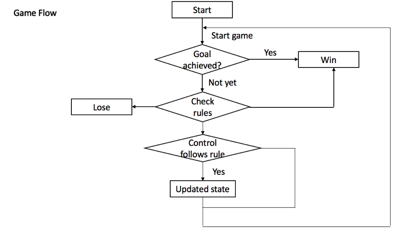
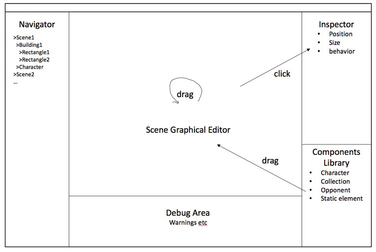
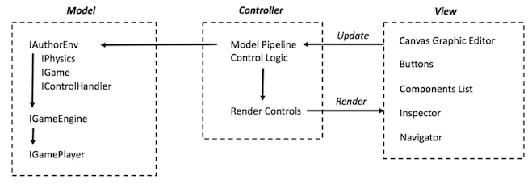

### Introduction
* Goal: Make a game authoring environment for a 2-d side scrolling platform game
* Flexibility: Level linking, character properties, winning condition, physics settings - support any type of side scrolling game, although not possible to support the most customized games
* Game data is open to both Authoring Environment, which allows users to edit the game, and Game Player & Engine, which use the game information to actually run the game. Authoring Environment and Game Player & Engine are independent of each other.
* Genre: Side scrolling platform game
* Moving background - ability to move if you move to the end of the screen, character always in the center area of the screen, background should be able to move both forwards and backwards
* Physics as an option, like non-physical, or affected by gravity and friction (can be different for different sprites)
* Characters can have potential ability of jumping, climbing, running, walking and interacting each other (e.g. monsters do damage to the player).
* Authoring Environment lets the user to create/modify the game (level, goal, sprites etc), and these information will be stored within a Game object. Game engine use the information to calculate each frame of the game under the hood,  which will be then provided for a game player to run/render the calculated frames.

### Overview

* Our project consists of four parts, game authoring environment, game data, game engine, and game player. 
* Game authoring environment (`AuthorEnvironment` class) supports creating and modifying game data (described in detail below). 
* Game data forms the core of the game, and sufficiently represents a game. It has a physics engine (`PhysicsEngine` class), a game (`Game` class), and a control module (`Control` class). The physics engine specifies how physics works, such as collision behavior, friction, and gravity. The game consists things such as sprites, and level information. The control module specifies how user input is handled. 
* Game engine (`GameEngine` class) takes a set of game data and runs the game. At the highest level, it provides a step() function that steps the game forward by a given elapsed time. This function maps the current state of the game and the user input to the next state of the game. 
* Game player (`GamePlayer` class) takes the game engine and renders the game on the screen. At a certain frame rate, it calls the `step()` function of the game engine, which updates the game data, and shows the resulting game data on the screen. 

### User Interface

### Design Details

* Authoring Environment creates and sets the information of the game. It can create a new Game object, and it can add levels to a game. It has the access to every setter/getter of the Game, Level, Physics Engine, etc. Once a user is done setting all these attributes, the game object will be serialized and saved for later use of the actual game playing.
* GameObject class contains everything that we need for a GameEngine to run. It contains several Level objects, and each Level object has some level specific data, for example sprites and goals.
* GameEngine and GamePlayer are two core parts to the actual game playing program. When the GamePlayer loads a game, it will unpack (re-instantiate) all the classes and hand them to the GameEngine. GameEngine uses the exact GameObject class (and all the classes within it, e.g. Level, Sprites etc) as in Authoring Environment.
* GameEngine essentially implements the step() function, where it is given an timeElapsed and does all the calculation for every sprite of each frame.
* GamePlayer is in charge of calling step() function and does the rendering of each frame based on the information of all the sprites.

### Example Games

* Super Mario Bros.
    * Multiple distinct levels - 8 stage world
    * Game play viewed from side-view camera angle
    * Characters move from left to right
    * One- and two-player
    * Goal to rescue Princess Toadstool from enemy Bowser
    * Coins scattered around game world for players to collect
    * Special bricks marked with question marks
    * Yellow mushroom to double mario size - gives special powers
    * Mario jumps on top of enemies to kill them

* Contra
    * Run and gun-style shoot-em ups
    * Player takes control of an armed commando
    * Fight and kill monsters
    * Also features 3D view where player must move towards the background in order to progress
    * Powerups around game world, replaces the player’s default weapon with a new one, such as a Laser Gun or a Spread Gun
    * Set number of lives (typically 3)
    * When hit, player loses a life along with any weapon they currently possess

* Flappy Bird
    * Constant motion game
    * Character is constantly falling, so it requires constant user input to keep going
    * Goal is surviving for as long/far as possible
    * Only one input: flapping
    * One player
    * One life

* Differences
    * Constantly moving background versus a background that moves as a response to the player moving
        * An option when setting the background - user can specify how the background should move, and if it moves automatically, user can set a speed
        * Background class holds this information as to how it should behave
    * Different number of players
        * One or two players - set through the components block of the UI
        * Sprites are instantiated as necessary, and Game Player will keep track of which characters are to be controlled through user input
    * Players get power in different ways e.g. guns, size of the player, or no power at all. These could be added to the sprite before the game starts or be power ups retrieved from the map. 
    * Goals can be more or less complex
        * Many different types of goals can occur in a 2-d scrolling game. In the examples above we see an example of a conquest type goal (rescuing a princess), a combat style goal (kill all of the enemies), and a  time related goal (survival). 
        * Other types of goals could include collecting a set of objects or a certain number of coins, or it could be as simple as making it to the end of each level. 
    * Differing number of lives
        * Each sprite, when initiated, will have its number of lives set
    * Items to collect, which give the player some advantage
        * CollisionHandler will handle collisions with certain objects appropriately - setting aspects of the character to give it some sort of power up
    * Different player input - tapping screen, key input, game controller

### Design Considerations  

* After the back-end and front-end teams are separated, the parameters and classes that are shared between the two subteams must be decided as soon as possible.
    * Front-end
        * What should the responsibility of game player do. We decide that it should be a purely front-end module and does not do any logical computation. 
    * Back-end
        * How to represent a goal of a level. A “goal” can involve collisions between sprite, or it can involve the survival time. Whether to have a Goal class/interface or to build the goals in Sprites to trigger.

